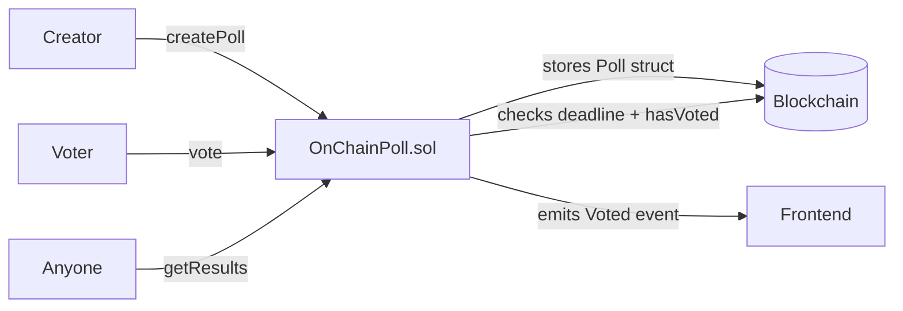

# OnChainPoll — Censorship-resistant on-chain voting with deadlines

> Create polls with multiple options, a voting deadline, and one vote per wallet.
> No backend. No admin. Results are public and permanent on the blockchain.


🔗 **Live demo:** _coming soon — Vercel_
📜 **Contract (Sepolia):** `0x...` _(deploy pending)_

---

## What it does

- Anyone can **create a poll** with 2–10 options and a custom voting window.
- Each wallet can vote **exactly once** per poll — enforced on-chain.
- Once the deadline passes, votes are **locked forever** — no one can alter results.
- Results are **readable by anyone**, from any frontend or directly from Etherscan.

## How it works



## Tech stack

| Layer | Tech |
|-------|------|
| Smart contract | Solidity 0.8.24 |
| Dev / testing | Foundry (forge, anvil) |
| Frontend | Next.js + wagmi + viem + RainbowKit |
| Network | Ethereum Sepolia testnet |

## Key design decisions

**Why `mapping` instead of an array for votes?**
Mappings in Solidity are O(1) lookups and don't require iteration — reading or writing
a vote costs the same gas whether there are 10 or 10,000 voters. Arrays would require
looping, which is expensive and can hit gas limits.

**Why a `deadline` with `block.timestamp`?**
`block.timestamp` is set by the miner/validator for each block (accurate to ~15s).
It lets the contract enforce time windows without any off-chain service.

**Why `struct Poll` with a `bool exists` field?**
Solidity initialises every storage slot to zero. Without `exists`, a poll with id=0
would be indistinguishable from an uninitialised slot. The boolean makes the check
explicit and readable.

## Testing ⭐

```bash
forge test -vvv
```

13 tests covering:
- ✅ Poll creation stores all data correctly and emits event
- ✅ Reverts: fewer than 2 options, more than 10, zero duration
- ✅ Vote counts increment correctly across multiple voters
- ✅ Reverts: double vote, vote after deadline, invalid option index, non-existent poll
- ✅ `isActive` returns correct value before and after deadline
- ✅ Multiple polls are fully independent (alice can vote in poll A and poll B)
- ✅ `vm.warp` used to simulate time travel past deadline

## Run locally

```bash
# install Foundry (once)
curl -L https://foundry.paradigm.xyz | bash && foundryup

# clone and test
git clone https://github.com/YOU/onchain-poll
cd onchain-poll
forge test -vvv

# deploy to Sepolia
cp .env.example .env
# fill in SEPOLIA_RPC_URL, PRIVATE_KEY, ETHERSCAN_API_KEY
forge script script/Deploy.s.sol --rpc-url $SEPOLIA_RPC_URL \
  --private-key $PRIVATE_KEY --broadcast --verify --etherscan-api-key $ETHERSCAN_API_KEY

# run frontend
cd frontend && npm install && npm run dev
```


---

## Contact

**Armando Ochoa** · Smart Contract Developer
📧 armaochoa99@gmail.com · Open to Web3 opportunities.

> Built as part of my blockchain developer journey.
